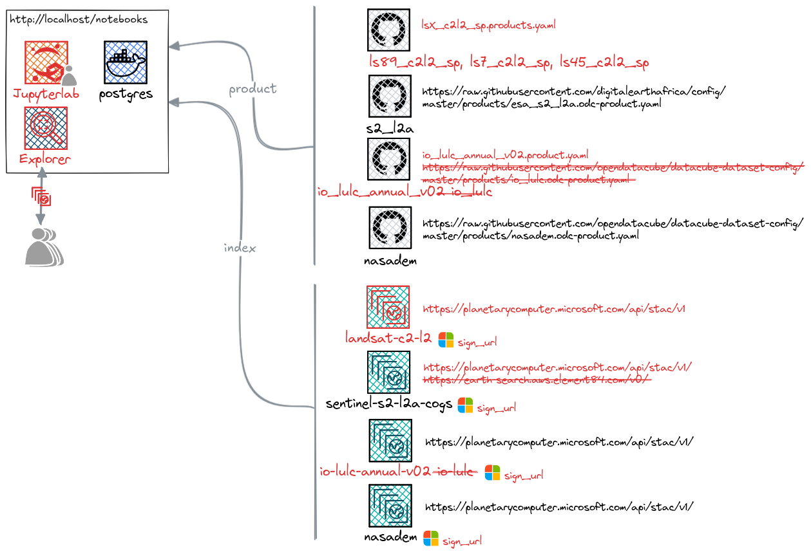

# Cube in a Box

The Cube in a Box is a simple way to run the [Open Data Cube](https://www.opendatacube.org). The current repository is based on [https://github.com/opendatacube/cube-in-a-box](https://github.com/opendatacube/cube-in-a-box) with several modifications (in red in next figure):

- Default Jupyter notebook replaced by Jupyterlab

- `sign_url` function added to access data in [Planetary Computer](https://planetarycomputer.microsoft.com/catalog)

- Default source for `Sentinel-2` ([https://earth-search.aws.element84.com/v0/](https://earth-search.aws.element84.com/v0/), slow and unstable) replaced by [Planetary Computer](https://planetarycomputer.microsoft.com/catalog)

- Default ESRI Land Cover source ([io-lulc]([Planetary Computer](https://planetarycomputer.microsoft.com/dataset/io-lulc)), deprecated) replaced by [io-lulc-annual-v02](https://planetarycomputer.microsoft.com/dataset/io-lulc-annual-v02)

- `Landsat Collection 2 Level 2 Science Products` added

- Jupyter notebook modified or created for each available product (they will run only if you run `make setup` without customization)

- [datacube-explorer](https://github.com/opendatacube/datacube-explorer) added and modified to access [Planetary Computer](https://planetarycomputer.microsoft.com/catalog) data (using `sign_url` function)

- `DATETIME` added as `make` argument

## How to use:

### 1. Local environment setup (Linux, macOS, Windows)

This project is run via `docker compose` and a `Makefile`. Before running `docker compose` commands through `make`, ensure you have:

- **Docker** with **Docker Compose** support
- **GNU Make**

Below are platform-specific setup instructions.

#### Linux

1. Install Docker Engine

   - Install Docker Engine for your distribution (Ubuntu/Debian/Fedora, etc.) using the [official Docker instructions](https://docs.docker.com/engine/install/).
   - Add your `user` to the `docker` group so you can run Docker without `sudo`, then log out/in.

2. Install Docker Compose

   - Recent Docker Engine installations include the Compose plugin and expose it as `docker compose ...`.
   - Verify:
     - `docker --version`
     - `docker compose version`

3. Install Make

   - Install GNU Make using your package manager.
   - Verify:
     - `make --version`

#### macOS

1. Install Docker Desktop

   - Install [Docker Desktop for Mac](https://docs.docker.com/desktop/setup/install/mac-install/) and ensure it is running.
   - Verify:
     - `docker --version`
     - `docker compose version`

2. Install Make

   - macOS typically has `make` available via Xcode Command Line Tools.
   - Install if needed: `xcode-select --install`
   - Verify:
     - `make --version`

#### Windows (recommended: WSL2 + Docker Desktop)

The simplest way to use `make` on Windows is to run the project inside **WSL2** (Windows Subsystem for Linux) while using **Docker Desktop** as the Docker backend.

1. Install WSL2

   - Install [WSL2](https://learn.microsoft.com/en-us/windows/wsl/install) and a Linux distribution (Ubuntu is a common choice).
   - Open your WSL terminal (e.g., Ubuntu).

2. Install Docker Desktop

   - Install [Docker Desktop](https://docs.docker.com/desktop/setup/install/windows-install/) for Windows and enable:
     - **Use WSL 2 based engine**
     - **WSL Integration** for your chosen Linux distribution (Settings → Resources → WSL Integration)

3. Install Make inside WSL

   - In your WSL terminal, install GNU Make:
     - Debian/Ubuntu: `sudo apt update && sudo apt install -y make`
   - Verify:
     - `make --version`

4. Verify Docker access from WSL

   In your WSL terminal, run:
     - `docker --version`
     - `docker compose version`
   
   If these work, WSL is correctly talking to Docker Desktop.

> Notes:
>
> - Run all `make ...` commands **from the WSL terminal** (not PowerShell) to ensure a consistent Linux-like environment.
> - Store the repository inside the WSL filesystem (e.g., `~/projects/...`) for better performance than `/mnt/c/...`.

#### Quick verification

Once installed, you should be able to run:

- `make --version`
- `docker --version`
- `docker compose version`

Then proceed with the project commands, for example:
- Default :`make setup`
- Switzerland 1 year: `make setup BBOX=5.95,45.81,10.50,47.81 DATETIME=2024-01-01/2024-12-31`
- Switzerland all years (till end 2025, might take a while (~15' in my case): `make setup BBOX=5.95,45.81,10.50,47.81 DATETIME=1984-01-01/2025-12-31`

### 2. Usage:

- Jupyterlab is available on [http://localhost/jupyter/](http://localhost/jupyter/) using the password `jupyterpassword` (default)

- Explorer is available on [http://localhost/explorer](http://localhost/explorer) 

# Specificities

- Sentinel 2 indexation requires `archive-less-mature` option in [Makefile](./Makefile) to keep only the most recent version of a given scene, but will trigger an ERROR message (which should be a WARNING as non-blocking).
